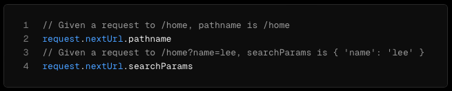
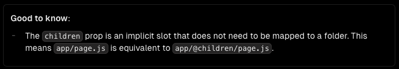
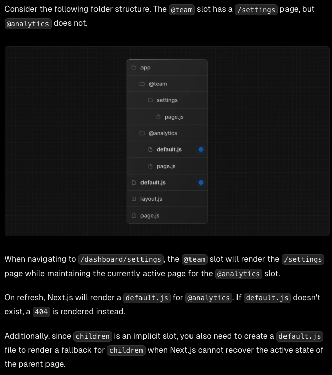
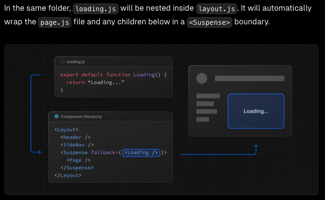
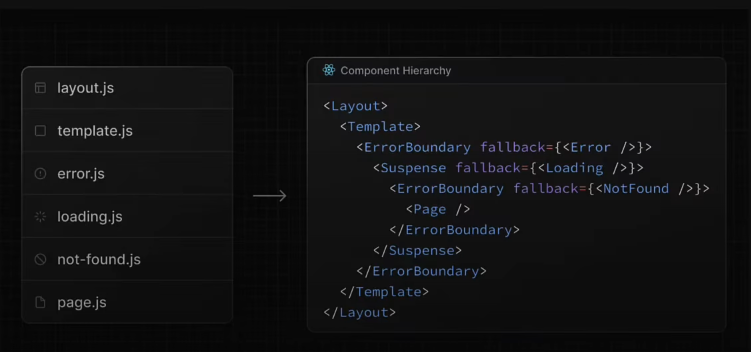

# Complete Beginner Guide to Next.js
Next.js is a React framework for building full-stack web applications. You use React Components to build user interfaces, and Next.js for additional features and optimizations.
&nbsp;
&nbsp;
&nbsp;
## Table of Content
* Getting Started
    - Automatic Installation
    - Running Your Project
* Routing
    - Routing
      - Routing Convention
      - Dynamic Routing: `[folderNameId]`
      - Catch-all Segments: `[...folderName]`
      - Optional Catch-all Segments: `[[...folderName]]`
      - Parallel Routes `@slotName`
      - Intercepting Routes
        - `(.)folderName`
        - `(..)folderName`
        - `(..)(..)folderName`
        - `(...)folderName`
    - Layouts
        - Root Layout (Require)
        - Templates
        - Not Found (`not-found.tsx`)
        - Loading (`loading.tsx` and `<suspense fallback={<Component>}>`)
        - Error (`error.tsx` or `global-error.tsx`)
    - Metadata
        - generateMetadata(): Metadata
        - Title Metadata
    - Linking and Navigating
        - Link Component
        - usePathname
        - useRouter (for client side)
        - redirect (for server side)
    - Project Organization
        - Safe Colocation by default
        - Route groups: `(folderName)`
        - Private Folders: `_folderName`
        - Module Path Aliases `@/components/button`
      - Route Handlers

* Rendering
* Data Fetching
* Styling

&nbsp;
&nbsp;&nbsp;

## Getting Started

### Automatic Installation
You create a new Next.js app using `create-next-app`, which sets up everything automatically for you. To create a project, run:

```bash
npx create-next-app@latest [directory-name]
```

After running the command, you'll see the following questions:
```bash
Would you like to use TypeScript? Yes
Would you like to use ESLint? Yes
Would you like to use Tailwind CSS? Yes
Would you like to use `src/` directory? Yes
Would you like to use App Router? (recommended) Yes
Would you like to customize the default import alias (@/*)? No 
```

### Running Your Project

First, run the development server:

```bash
npm run dev
```

Open [http://localhost:3000](http://localhost:3000) with your browser to see the result. Now you have a Next.js app up and running. In the next section we'll dive into the project structure.

&nbsp;
&nbsp;
&nbsp;

## Routing
Next.js has a file-system based routing mechanism. URL paths that users can access in the browser are defined by files and folders in your codebase. 

### Routing Convention
All routes must be placed inside the app folder. Every folder corresponds to a path segment in the browser URL. Each folder should have a file named `page.tsx` in which you do a default export of a function which returns jsx.

```tsx
export default function HomePage() {
    return <h1>Hello World</h1>;
};
```

#### Parallel Routes
Parallel Routes allows you to simultaneously or conditionnally render one or more pages within the same layout. They are useful for highly dynamic sections of an app such as dashboards and feeds on social sites.

##### Parallel Routes Convention : `@slotName`
Parallel routes are created using named slots. Slots ared defined with the `@folder` convention. For example, the following structure defines two slots: `@analytics` and `@team`:



##### Slots are Passed as Props to the Shared Parent Layout
Slots are passed as props to the shared parent layout (type of ReactNode). For the example above, the component in `app/layout.js` now accepts the `@analytics` and `@team` slots props, and can render them in parallel alongside the `children` prop:

```tsx
type LayoutProps: {
    children: React.ReactNode,
    analytics: React.ReactNode,
    team: React.ReactNode
};

export default function Layout({ children, analytics, team }: LayoutProps) {
    return (
        <div>
            {children}
            {analytics}
            {team}
        </div>
    )
}
```

##### Slots do not affect the URL structure
However, slots are not route segments and do not affect the URL structure. For example, for `/dashboard/@analytics/views`, the URL will be `/dashboard/views` since `@analytics` is a slot.



##### Active state and navigation
By default, Next.js keeps track of the active state (the active subpage) for each slot. However, the content rendered within a slot will depend on the type of navigation:
- Soft Navigation (with the `Link` component): During client-side navigation, Next.js will perform a partial render, changing the subpage within the slot while maintaining the other slot's active subpages, even if they don't match the current URL.
- Hard Navigation: After a full-page load (browser refresh), Next.js cannot determine the active state for the slots that don't match the current URL. Instead, it will render a `default.js` file for the unmatchde slots, or `404` page if `default.js` doesn't exist.

###### `default.js`
You can define a `default.js` file to render as a fallback for unmatched slots during the initial load or full-page reload.



###### `useSelectedLayoutSegment(s)`
Both `useSelectedLayoutSegment` and `useSelectedLayoutSegments` accept a `parallelRoutesKey` parameter of type `string`, which allows you to read the active route segment of the specified slot.

```tsx
"use client";

import { useSelectedLayoutSegment } from "next/navigation";

export default function ({ auth }: { auth: React.ReactNode }) {
    const teamSegment = useSelectedLayoutSegment("auth");
    //...
}
```

When a user navigates to `app/@auth/login` or (`/login` in the Url bar), `loginSegment` will be equal to `"login"`.

When using `useSelectedLayoutSegments`, it will return an array of strings containing the active segments one level down from the layout the hook was called from. Or an empty array if none exist.

For more info: https://nextjs.org/docs/app/building-your-application/routing/parallel-routes

### Layouts
A layout is UI that is shared between multiple routes. On navigation, layouts do not re-render. Layouts can also be nested. You can define a layout by default exporting a React component from a `layout.tsx` file. The component should accept a `children` prop of type `React.ReactNode` that will be populated with a child layout (if it exists) or a page during rendering.

```tsx
export default function DashboardLayout({
  children, // will be a page or nested layout
}: {
  children: React.ReactNode
}) {
  return (
    <section>
      {/* Include shared UI here e.g. a header or sidebar */}
      <nav></nav>
 
      {children}
    </section>
  )
}
```

#### Root Layout (Required)
The root layout is defined  at the top level of the `app` directory and applies to all routes. The layout is required and must contain `html` and `body` tags, allowing you to modify the initial HTML returned from the server.

```tsx
export default function RootLayout({ children }: { children: React.ReactNode }) {
    return (
        <html lang='en'>
            <body>
                {/* Root Layout UI */}
                { children }
            </body>
        </html>
    )
}
```

#### Templates
Templates ares similar to layouts in that they wrap each child layout or page. However, the difference is that unlike layouts that persist across routes and maintain state, templates create a new instance for each of their children on navigation. This means that when a user navigates between routes that share a template, a new instance of the component is mounted, DOM elements are recreateds, states is not preserved and effects are re-synchronized.

A template can be defined by exporting a default React component from a template.js file. The component should accept a children prop.

```tsx
export default function Template({ children }: { children: React.ReactNode }) {
  return <div>{children}</div>
}
```

#### Loading
The special file `loading.js` helps you create meaningful Loading UI with React Suspense. With this convention, you can show an instant loading state from the server while the content of a route segment loads. The new content is automatically swapped in once rendering is complete.

```tsx
export default function Loading() {
    return <LoadingSkeleton />;
}
```



You can accomplish the same thing in your ui components too.

```tsx
import { Suspense } from 'react'
import { PostFeed, Weather } from './Components'
 
export default function Posts() {
  return (
    <section>
      <Suspense fallback={<p>Loading feed...</p>}>
        <PostFeed />
      </Suspense>
      <Suspense fallback={<p>Loading weather...</p>}>
        <Weather />
      </Suspense>
    </section>
  )
}
```

#### Error Handling
The `error.js` file convention allows you to gracefully handle unexpected runtime errors in nested routes.



Create error UI by adding an error.js file inside a route segment and default exporting a React component:

```tsx
// Error components must be Client components
"use client";

type ErrorBoundaryProps = {
    error: Error & {
        digest?: string
    },
    reset(): void
};

export default function ErrorBoundary({ error, reset }: ErrorBoundaryProps) {
    return (
        <>
            <h2>Something went wrong!</h2>
            {/* Attempt to recover by trying to re-render the segment */}
            <button onClick={() => reset()}>
                Try again
            </button>
        </h2>
    );
};

```

### Metadata
In the `app` directory, you can modify the `<head>` HTML elements such as `title` and `meta` by using the Metadata API. You should not manually add `<head>` tags such as `<title>` and `<meta>` to root layouts. Instead, you should use the Metadata API which automatically handles advanced requirements such as streaming and de-duplicating `<head>` elements.

Metadata can be defined by exporting a `metadata` object of type `Metadata` from 'next' or `generateMetadata` function that returns an object of type `Metadata` in a layout.js or page.js file.

```tsx
// Exporting a static metadata object
import { Metadata } from 'next';

export const metatda: Metadata = {
    title: "Next.js",
    description: "My Next.js file"
};

export default function Page() {
    return '...';
};
```

```tsx
// Exporting a dynamic generateMetadata function
import { Metadata } from 'next';

type PageProps = {
    params: {
        blogId: string
    }
};

export const generateMetadata = ({ params }: PageProps): Metadata => {
    return {
        title: `Next.js blog ${params.blogId}`,
        description: "My Next.js file"
    }
};

export default function Page() {
    return '...';
};
```

```tsx
// Exporting a dynamic generateMetadata function
import { Metadata } from 'next';

type PageProps = {
    params: {
        blogId: string
    }
};

export const generateMetadata = async ({ params }: PageProps): Metadata => {
    const description = await fetchBlogDescription(params.blogId);
    return {
        title: `Next.js blog ${params.blogId}`,
        description: `${description} | Next.js`
    }
};

export default function Page() {
    return '...';
};
```

Both `layout.tsx` and `page.tsx` files can export metadata. If defined in a layout, it applies to all pages in that layout, but if defined in a page, it applies only to that page. Metadata is read in order, from the root level down to the final page level. When there's metadata in multiple places for the same route, they get combined, but page metadata will replace layout metadata if they have the same properties.

#### Title Metadata
The title field's primary purpose is to define the document title. You can define it either by a simple string (view example above or as an object).

```tsx
import { Metadata } from 'next';

export const metadata: Metadata = {
    title: {
        // Useful when you want to provide a title that completely ignores the title
        // template set in the parent segments.  
        absolute: '', 

        // Useful when you want to provide fallback title for child route segments
        // that don't explicitly specify a title.
        default: 'Next.js Tutorial | dthiernoo', 

        // Useful when you want to create dynamic titles by addung a prefix or a suffix.
        // It applies to child route segments and not the segment in which it is defined.
        template: '%s | dthiernoo'
    }
};

export default function Page() {
    return '...';
};
```

### Linking and Navigating
There are four ways to navigate between routes in Next.js:
- Using the `<Link>` Component
- Using the useRouter hook (Client Components)
- Using the redirect function (Server Components)

#### Link Component
`<Link>` is a built-in component that extends the `<a>`HTML tag to provide prefetching and client-side navigation between routes. It is the primary way and recommended way to navigate between routes in Next.js.

You can use it by importing it from `next/link`, and passing a href props to the component:
```tsx
import Link from 'next/link';

export default function Page() {
    return <Link href={"/dashboard"}>Dashboard</Link>
};
```

For more info: https://nextjs.org/docs/app/api-reference/components/link


#### usePathname
You can use `usePathname()` to get the current pathname. This could be used to determine if a link is active.

```tsx
import { usePathname } from 'next/navigation';
import Link from 'next/link'
 
export function Links() {
  const pathname = usePathname()
 
  return (
    <nav>
      <ul>
        <li>
          <Link className={`link ${pathname === '/' ? 'active' : ''}`} href="/">
            Home
          </Link>
        </li>
        <li>
          <Link
            className={`link ${pathname === '/about' ? 'active' : ''}`}
            href="/about"
          >
            About
          </Link>
        </li>
      </ul>
    </nav>
  )
}
```

#### useRouter hook
The `useRouter` hook allows you to programmatically change routes from Client Components. It is recommended to use `<Link>` component to navigate between routes unless you have a specific requirement for using `useRouter`.

```tsx
"use client"

import { useRouter } from 'next/navigation';

export default function Page() {
    const router = useRouter();

    return (
        <button type="button" onClick={() => router.push('/dashboard')}>
            Dashboard
        </button>
    )
}

```

Reference: https://nextjs.org/docs/app/api-reference/functions/use-router


#### redirect function
For Server Components, use the `redirect` function instead.

```tsx
import { redirect } from 'next/navigation'
 
async function fetchTeam(id: string) {
  const res = await fetch('https://...')
  if (!res.ok) return undefined
  return res.json()
}
 
export default async function Profile({ params }: { params: { id: string } }) {
  const team = await fetchTeam(params.id)
  if (!team) {
    redirect('/login')
  }
 
  // ...
}

```

### Route Handlers
#### Convention
Route Handlers allow you to create custom request handlers for a given route using the Web Request and Response APIs. Route Handlers are defined in a `route.ts` file inside the `app` directory:
```tsx
export const dynamic = "force-dynamic" // Disables caching for the GET request
export async function GET(request: Request) {}
```

#### Supported HTTP Methods
The following `http` methods are supported by Next.js:
- `GET`: The GET method requests a representation of the specified resource. Requests using GET should only retrieve data.
- `HEAD`: The HEAD method asks for a response identical to a GET request, but without the response body.
- `POST`: The POST method submits an entity to the specified resource, often causing a change in state or side effects on the server.
- `PUT`: The PUT method replaces all current representations of the target resource with the request payload.
- `PATCH`: The PATCH method applies partial modifications to a resource.
- `DELETE`: The DELETE method deletes the specified resource.
- `OPTIONS`: The OPTIONS method describes the communication options for the target resource.

#### Extended `NextResponse` and `NextRequest` APIs
In addtion to supporting the native `Request` and `Response`. Next.js extends them with `NextRequest` and `NextResponse` to provide convenient helpers for advenced cases.

They extend the native request and response API with additional convenience methods.
`cookies`:
- `set(name, value)`: Given a name, set a cookie with the given value on the request.
```tsx
request.cookies.set('theme', 'dark')
```
- `get(name)`: Given a cookie name, return the value of the cookie. If the cookie is not found, undefined is returned. If multiple cookies are found, the first one is returned.
- `getAll()`:  Given a cookie name, return the values of the cookie. If no name is given, return all cookies on the request.
- `delete(name)`: Given a cookie name, delete the cookie from the request.
- `has(name)`: Given a cookie name, return true if the cookie exists on the request.
- `clear()`: Remove the Set-Cookie header from the request.

#### `NextRequest`
##### `nextUrl`
Extends the native URL API with additional convenience methods, including Next.js specific properties.

#### `NextResponse`
##### `json()`
Produce a response with the given JSON body.
```tsx
import { NextResponse } from 'next/server'
 
export async function GET(request: Request) {
  return NextResponse.json({ error: 'Internal Server Error' }, { status: 500 })
}
```

##### `redirect()`
Produce a response that redirects to a URL.
```tsx
import { NextResponse } from 'next/server'
 
return NextResponse.redirect(new URL('/new', request.url))
```


#### Handlers Parameters
Each HTTP handler has two parameters:
- `request` (optional): The `request` object is a `NextRequest` object, which is an extension of the Web `Request` APO.
- `context` (optional): Currently, the only value of `context` is `params`, which is an object containing the dynamic route parameters for the current route.
```tsx
// app/api/team/[teamId]/route.ts
import { type NextRequest } from 'next/server';

type ContextType = {
  params: {
    teamId: string
  }
}

export const dynamic = "force-dynamic" // Disable caching for the Get request

export async function GET(request: NextRequest, context: ContextType) {
  const teamId = context.params.teamId; // '10'
  // ...
}
```

#### Streaming
In Next.js, streaming refers to the ability to deliver data to the client incrementally as it becomes available, rather than waiting for the entire dataset to be processed before sending any response. It is commonly used in combination with Large Language Models (LLMs), such as OpenAI, for AI-generated content. Learn more about the AI SDK.

```tsx
// app/api/chat/route.ts
import OpenAI from 'openai'
import { OpenAIStream, StreamingTextResponse } from 'ai'
 
const openai = new OpenAI({
  apiKey: process.env.OPENAI_API_KEY,
})
 
export const runtime = 'edge'
 
export async function POST(req: Request) {
  const { messages } = await req.json()
  const response = await openai.chat.completions.create({
    model: 'gpt-3.5-turbo',
    stream: true,
    messages,
  })
 
  const stream = OpenAIStream(response)
 
  return new StreamingTextResponse(stream)
}
```


#### Request Body
You can read the `Request` body using the standard Web Api methods:
```tsx
export async function POST(request: Request) {
  const res = await request.json()
  return Response.json({ res })
}
```

#### Request Body FormData
You can read the FormData using the request.formData() function:
```tsx
export async function POST(request: Request) {
  const formData = await request.formData();
  const name:string = formData.get('name')
  const email:string = formData.get('email')
  return Response.json({
    name,
    email
  })
}
```
Since `formData` data are all strings, you may want to use `zod-form-data` to validate the request and retrieve data in the format you prefer (e.g. number).